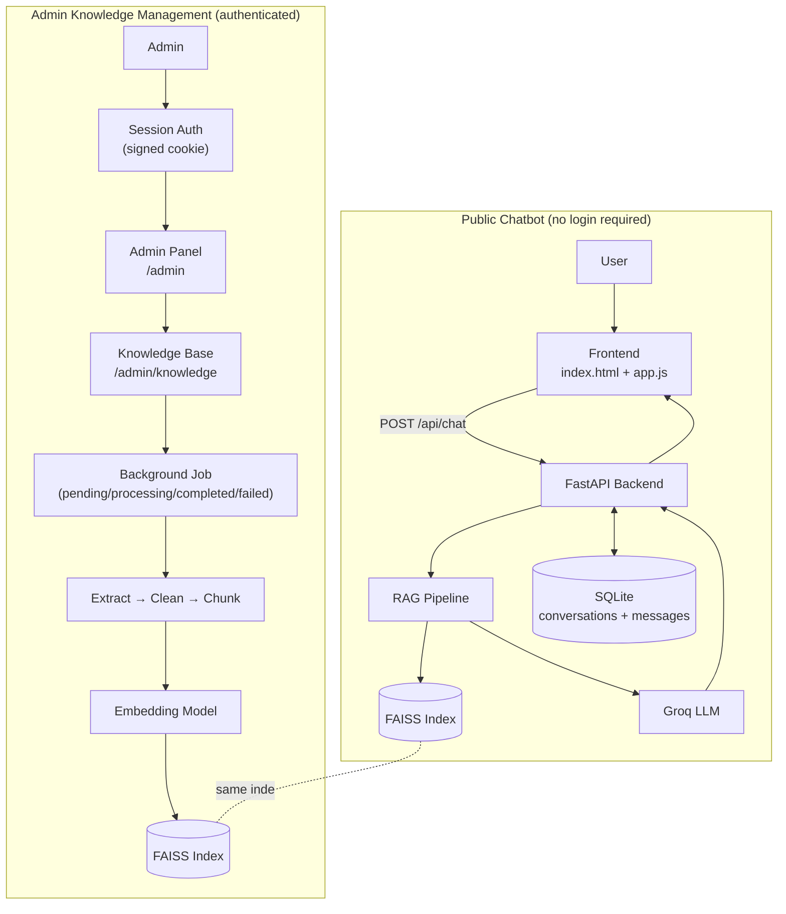
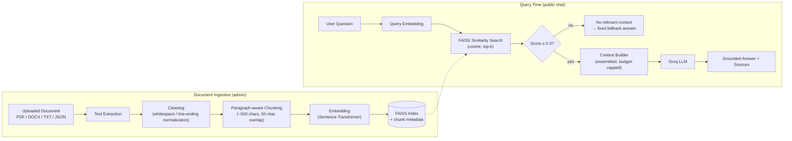
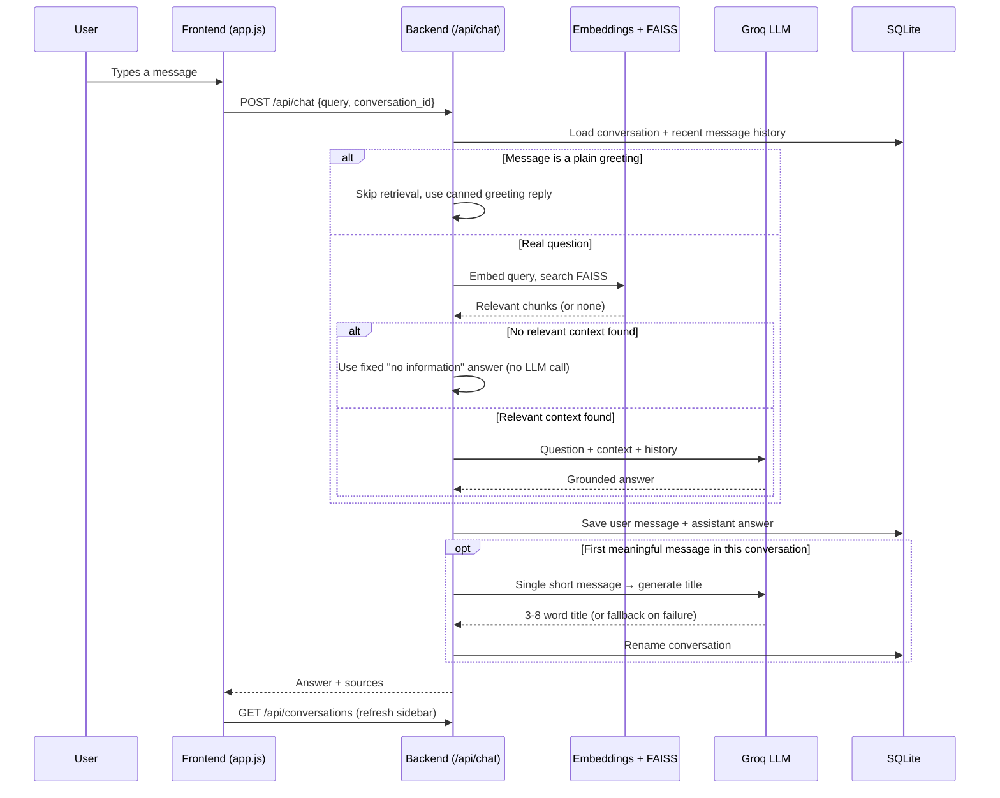

# 🤖 PersonaAI

> **PersonaAI is your own AI knowledge assistant — a retrieval-augmented chatbot that answers questions strictly from documents you give it, with a full admin panel to manage what it knows.**

Built from the ground up (no LangChain, no LlamaIndex) as a personal AI profile assistant, PersonaAI's underlying architecture is a general-purpose RAG system: upload your own documents, and it becomes a private knowledge chatbot, a company-specific assistant, or a foundation for a customized AI product — grounded in your content, never inventing facts it wasn't given.


---

## ✨ Features

**Chat & RAG**
- Retrieval-Augmented Generation over your own documents — the LLM answers only from retrieved context, never from its own general knowledge
- Grounded responses with an explicit "I don't have that information in my knowledge base" fallback when nothing relevant is found
- Source references (chunk, source document, similarity score) returned with every answer
- Conversation memory — recent messages are included so follow-up questions work naturally
- Automatic, LLM-generated conversation titles (ChatGPT-style) after the first meaningful message, with a safe non-LLM fallback and language-matching (e.g. Urdu input → Urdu title)
- Manual conversation rename and delete from the sidebar
- Responsive UI with light/dark mode (desktop, tablet, mobile)

**Knowledge Base (Admin)**
- Document upload: **PDF, DOCX, TXT, JSON**
- Background processing — uploads return immediately while extraction/chunking/embedding/indexing happen asynchronously, with a live `pending → processing → completed/failed` status
- Document replace and delete, safely synchronized with the FAISS index
- Full FAISS index rebuild from the stored knowledge (recovery tool)
- Knowledge Base integrity validation (detects missing/corrupted index, count mismatches, orphaned chunks, failed/stuck processing, and more)

**Admin Panel**
- Session-based authentication protecting `/admin` and everything under it
- Dashboard with live knowledge base / conversation stats
- Rate-limited login (lockout after repeated failed attempts)

Only functionality that is actually implemented is listed above.

---

## 🏗️ System Architecture



PersonaAI is a single FastAPI application (`app/main.py`) with two independent surfaces sharing the same underlying services:

- **Public chatbot** (`/`) — no authentication, talks to the RAG pipeline and stores conversation history in SQLite.
- **Admin panel** (`/admin/*`) — authenticated, manages the knowledge base that the public chatbot retrieves from.

Both sides call the exact same embedding model instance, the exact same FAISS store, and the exact same LLM service — there is no duplicated logic between "admin ingestion" and "chat retrieval."

---

## 🔄 RAG Pipeline



1. **Text Extraction** — PyMuPDF for PDF, `python-docx` for DOCX, UTF-8 decode for TXT, and a recursive key/value flattener for JSON, all producing plain text.
2. **Cleaning** — deterministic only: normalizes line endings, collapses repeated whitespace, trims blank-line runs. No summarizing or rewriting.
3. **Chunking** — paragraph-aware, target size ~500 characters with 50-character overlap between chunks so ideas that fall on a chunk boundary aren't lost.
4. **Embedding** — each chunk is turned into a normalized vector with a local Sentence Transformer model.
5. **FAISS Indexing** — vectors are added to a FAISS `IndexFlatIP` (cosine similarity via dot product on normalized vectors); each vector's chunk text, source filename, document id, and upload timestamp are kept in parallel metadata.
6. **Query Embedding & Search** — a user's question is embedded the same way and matched against the index; results below a 0.3 similarity threshold are discarded as irrelevant.
7. **Context Assembly** — relevant chunks are combined into a single context string, capped at ~2000 characters (the top result is always included in full even if it alone exceeds the budget).
8. **Grounded Generation** — the question, context, and recent conversation history are sent to Groq with a system prompt that instructs it to answer only from the given context and say so explicitly when it can't.

---

## 💬 Chat Flow



A new conversation row isn't created until the very first message is actually sent (clicking "New Chat" just resets the local view). Title generation only ever runs once per conversation — on the first non-greeting message — and never blocks or breaks the chat response if it fails.

---

## 📚 Knowledge Base

Everything related to documents — upload, viewing, replacement, deletion, and processing status — lives under a single admin section: **`/admin/knowledge`**. There is no separate "Documents" page.

### Supported file types
`.pdf`, `.docx`, `.txt`, `.json` (JSON is flattened into readable `key: value` lines before chunking).

### Upload → indexing flow
1. Admin selects a file on `/admin/knowledge`; it's validated (extension, non-empty, size limit) and a background job is created with status **`pending`**.
2. The upload request returns immediately with a job id — the browser is never blocked waiting for processing.
3. In the background, the job status moves to **`processing`** while the file is extracted, cleaned, chunked, and embedded.
4. On success, the new vectors are added to the active FAISS index, the index is saved to disk, and the job becomes **`completed`**.
5. If anything fails at any stage, the job becomes **`failed`** with a stored error message — the FAISS index is never left partially written.

The admin page polls job status and shows each recent upload's progress (`pending` / `processing` / `completed` / `failed`) without a page reload.

### Document management
- **View** — inspect a document's metadata and chunk previews.
- **Replace** — the new file is fully validated and processed *before* the old document's data is touched, so a bad replacement file can never destroy the existing one.
- **Delete** — removes the document's vectors from FAISS (via FAISS's native vector removal, not a placeholder/soft-delete) and its metadata together.

### Re-indexing & recovery
An admin can trigger a **full FAISS rebuild** at any time: it re-embeds every chunk's already-stored text (the stored chunk text is treated as the source of truth) into a brand-new index, validates it, and only swaps it in once the rebuild is confirmed complete — the previous index is left untouched if the rebuild fails.

### Integrity validation
A **"Run Integrity Check"** action inspects the current knowledge base for:
- Missing or corrupted FAISS index files
- FAISS vector count vs. metadata count mismatches
- Chunks missing required metadata, or with no source attribution
- Invalid or duplicate document references
- Failed or stuck (long-running) processing jobs

This never modifies data — it only reports. When a FAISS-specific issue is found, the UI offers a one-click rebuild using the mechanism above.

---

## 🔐 Admin Panel

| Aspect | Details |
|---|---|
| Login URL | `/admin/login` |
| Panel URL | `/admin` |
| Authentication | Signed, `httponly` session cookie (12-hour expiry) issued after credential verification |
| Password storage | **Hashed** (scrypt) — the plaintext password is never stored |
| Rate limiting | 5 failed login attempts from the same IP triggers a 5-minute lockout |

### How admin credentials are configured

Credentials are **not hardcoded** — they come entirely from environment variables:

```env
ADMIN_USERNAME=your_username
ADMIN_PASSWORD_HASH=your_generated_scrypt_hash
SESSION_SECRET_KEY=a_long_random_secret_string
```

> ⚠️ `ADMIN_PASSWORD_HASH` must be a **scrypt hash**, not a plaintext password. Generate one with:
> ```python
> from app.services.auth_service import hash_password
> print(hash_password("your-chosen-password"))
> ```
> Then log in using the plaintext password you hashed — never the hash itself.

Once logged in, the admin can:
- View live stats on the **Dashboard** (`/admin`) — chunk count, documents indexed, conversation count, system status
- Manage the entire **Knowledge Base** (`/admin/knowledge`) — upload, replace, delete, rebuild, and validate, as described above
- **Log out** (`/admin/logout`), which invalidates the session server-side

---

## 🔑 Environment Variables

Create a `.env` file in the **project root** (next to `requirements.txt`):

```text
project-root/
├── .env
├── requirements.txt
├── README.md
├── data/                      (created automatically — SQLite DB + FAISS index)
└── app/
    ├── main.py
    ├── admin_routes/
    ├── services/
    ├── static/
    └── templates/
```

| Variable | Required | Purpose | Used in |
|---|---|---|---|
| `GROQ_API_KEY` | **Yes** | Authenticates requests to the Groq API for answer generation and conversation titles | `app/services/llm_service.py` |
| `ADMIN_USERNAME` | Yes, for admin access | The admin login username | `app/services/auth_service.py` |
| `ADMIN_PASSWORD_HASH` | Yes, for admin access | Scrypt hash of the admin password (see above — never a plaintext password) | `app/services/auth_service.py` |
| `SESSION_SECRET_KEY` | Yes, for admin access | Secret key used to sign admin session cookies | `app/services/auth_service.py` |
| `ADMIN_COOKIE_SECURE` | No (default `true`) | Set to `false` only for local HTTP testing without TLS; controls the `Secure` cookie flag | `app/services/auth_service.py` |
| `EMBEDDING_MODEL_NAME` | No (default `all-MiniLM-L6-v2`) | Overrides the Sentence Transformer model used for embeddings | `app/services/embedding_service.py` |
| `KB_MAX_UPLOAD_MB` | No (default `10`) | Maximum accepted upload size, in megabytes | `app/services/knowledge_service.py` |
| `PERSONAAI_DB_PATH` | No (default `data/personaai.db`) | Overrides the SQLite database file location | `app/services/database.py` |

Example `.env`:

```env
GROQ_API_KEY=your_groq_api_key_here
ADMIN_USERNAME=admin
ADMIN_PASSWORD_HASH=generated_scrypt_hash_here
SESSION_SECRET_KEY=a_long_random_string_here
```

You can get a Groq API key from [console.groq.com](https://console.groq.com).

> `.env` is already listed in `.gitignore` — never commit it.

---

## 🧪 Installation

```bash
# 1. Clone the repository
git clone <your-repository-url>

# 2. Enter the project directory
cd "Persona AI"

# 3. Create a virtual environment
python -m venv venv

# 4. Activate it
# Windows:
venv\Scripts\activate
# macOS/Linux:
source venv/bin/activate

# 5. Install dependencies
pip install -r requirements.txt

# 6. Create your .env file in the project root
#    (see the Environment Variables section above)

# 7. Generate an admin password hash (for ADMIN_PASSWORD_HASH)
python -c "from app.services.auth_service import hash_password; print(hash_password('your-password'))"
```

There is no separate "initialize index" step to run manually — the SQLite database and FAISS index are created automatically on first startup, and the knowledge base is populated by uploading documents through `/admin/knowledge` once the app is running.

---

## ▶️ Running PersonaAI

```bash
uvicorn app.main:app --reload
```

| | |
|---|---|
| Local URL | `http://127.0.0.1:8000` |
| Interactive API docs (Swagger) | `http://127.0.0.1:8000/docs` |

`--reload` is for local development (auto-restarts on code changes); omit it for a longer-running process. No host/port is hardcoded in the application, so uvicorn's defaults apply unless you pass `--host`/`--port` explicitly.

On startup, the app initializes the SQLite database, loads any previously saved FAISS index from disk, and loads the embedding model once — if the embedding model fails to load, the application intentionally fails to start rather than serving broken retrieval silently.

---

## 🌐 Application URLs

| URL | Purpose | Auth required |
|---|---|---|
| `/` | Public chatbot | No |
| `/admin/login` | Admin login | No |
| `/admin` | Admin dashboard | Yes |
| `/admin/knowledge` | Knowledge Base management | Yes |
| `/admin/logout` | Admin logout | Yes |
| `/api/chat` | Send a chat message | No |
| `/api/conversations` | List / create conversations | No |
| `/api/conversations/{id}` | Get / rename / delete a conversation | No |
| `/api/conversations/{id}/messages` | List / add messages | No |
| `/docs` | Interactive API documentation (Swagger UI) | No |

> The public API endpoints above have no user-level authentication by design — PersonaAI's chatbot is meant to be publicly usable, while only the *knowledge base* is protected behind admin auth.

---

## 📁 Project Structure

```text
Persona AI/
├── .env                         # Your local secrets (not committed)
├── requirements.txt
├── data/                        # SQLite DB + FAISS index (gitignored)
│   ├── personaai.db
│   └── vector_store/
│       ├── index.faiss
│       └── metadata.json
└── app/
    ├── main.py                  # FastAPI app, lifespan startup, public + chat API routes
    ├── admin_routes/
    │   └── router.py            # All /admin/* routes (login, dashboard, knowledge base)
    ├── services/
    │   ├── auth_service.py      # Admin credential verification, session tokens, rate limiting
    │   ├── database.py          # SQLite connection + schema
    │   ├── conversation_service.py  # Conversations, messages, title sanitization
    │   ├── document_processor.py    # File type detection, extraction, cleaning
    │   ├── chunker.py           # Paragraph-aware chunking
    │   ├── embedding_service.py # Embedding model lifecycle + encoding
    │   ├── vector_store.py      # FAISS index wrapper (add/remove/save/load)
    │   ├── context_builder.py   # Turns search results into LLM context
    │   ├── llm_service.py       # Groq integration (answers + titles)
    │   ├── knowledge_service.py # Upload/replace/delete/rebuild/validate orchestration
    │   └── job_service.py       # In-memory background job status tracking
    ├── templates/
    │   ├── index.html           # Public chatbot UI
    │   ├── admin_login.html
    │   ├── admin_dashboard.html
    │   ├── admin_knowledge.html
    │   └── _admin_sidebar.html
    └── static/
        ├── css/ (style.css, admin.css)
        └── js/ (app.js, admin.js)
```

---

## 🧠 Embeddings & FAISS

- **Model**: `sentence-transformers`, default `all-MiniLM-L6-v2` (configurable via `EMBEDDING_MODEL_NAME`).
- **Loading**: the model is loaded **once**, at application startup (inside the FastAPI `lifespan` handler), guarded by a thread lock so concurrent requests can never trigger a duplicate load. Every subsequent embedding call — document ingestion, index rebuild, and chatbot query embedding — reuses that same in-memory instance.
- **Vector store**: FAISS `IndexFlatIP` (inner product on unit-normalized vectors, equivalent to cosine similarity).
- **Metadata**: each vector's position maps to a metadata record (`chunk_id`, `source` filename, `document_id`, `file_type`, `uploaded_at`, and the chunk's own text) so results are always traceable back to their source document.
- **Persistence**: the index and metadata are saved to `data/vector_store/index.faiss` / `metadata.json` using an atomic write-then-rename, so a crash mid-save can never leave a corrupted file in place.
- **Re-indexing**: a full rebuild re-embeds all currently stored chunk text into a fresh index and only replaces the active one after the rebuild is verified complete.

---

## 💾 Conversation History

- Stored in **SQLite** (`conversations` and `messages` tables), completely independent of the FAISS knowledge base.
- Each message records its `role` (`user`/`assistant`), `content`, and timestamp; conversations track `title`, `created_at`, and `updated_at`.
- The sidebar lists conversations ordered by most recently updated, refreshed after every message.
- **New conversation**: clicking "New Chat" only resets the local UI — the conversation row itself isn't created until the first message is actually sent.
- **Conversation titles**: start as `"New Conversation"`; after the first non-greeting message, a title is generated automatically (via Groq, 3–8 words, matching the message's language) with a safe fallback (first few words of the message) if generation fails. Titles are sanitized (HTML stripped, length-capped) before being stored. Titles can also be renamed or the conversation deleted manually from the sidebar.
- **Memory**: recent messages (last 6) from the current conversation are included when generating each new answer, so follow-up questions have context.

---

## 🔒 Security

Implemented:
- Admin routes are protected by a signed, `httponly`, `SameSite=Lax` session cookie — never a raw username/password stored client-side.
- Passwords are never stored in plaintext — only a scrypt hash (`ADMIN_PASSWORD_HASH`).
- Login is rate-limited per IP (lockout after repeated failures).
- Uploaded filenames are sanitized (directory components stripped, restricted character set) before being used anywhere, preventing path traversal.
- Document identifiers are validated server-side against a strict format before any lookup or deletion.
- Upload size and file type are validated before processing.
- All knowledge-base mutation endpoints (upload, replace, delete, rebuild, validate) require an authenticated admin session.
- Secrets (`GROQ_API_KEY`, `SESSION_SECRET_KEY`, etc.) are read from environment variables, never hardcoded.

### Security Recommendations
*(Recommendations only — not currently implemented.)*
- Add HTTPS/TLS termination in front of the app for any non-local deployment.
- Consider a persistent, multi-worker-safe session/rate-limit store (current implementation is in-memory and single-process).
- Add automated dependency vulnerability scanning.
- Consider request-size limits at the reverse-proxy layer in addition to the application-level upload cap.

---

## ⚙️ Configuration

### Required
- `GROQ_API_KEY` — without it, chat answers and title generation cannot be produced.
- `ADMIN_USERNAME`, `ADMIN_PASSWORD_HASH`, `SESSION_SECRET_KEY` — without these, `/admin` login cannot succeed.

### Optional
- `ADMIN_COOKIE_SECURE` — defaults to secure cookies (`true`); only disable for local non-HTTPS testing.
- `EMBEDDING_MODEL_NAME` — swap the embedding model without touching code.
- `KB_MAX_UPLOAD_MB` — adjust the upload size limit.
- `PERSONAAI_DB_PATH` — relocate the SQLite database file.

---

## 🐛 Troubleshooting

**"GROQ_API_KEY is not set" errors**
Ensure `.env` exists in the project root and contains a valid `GROQ_API_KEY`, then restart the app (env vars are loaded at startup).

**Admin login always fails**
Confirm `ADMIN_USERNAME`, `ADMIN_PASSWORD_HASH`, and `SESSION_SECRET_KEY` are all set. Remember `ADMIN_PASSWORD_HASH` must be a **generated hash**, not your plaintext password — log in with the plaintext password you hashed.

**App fails to start with an embedding model error**
The first run downloads the Sentence Transformer model, which requires internet access. Subsequent runs load it from the local cache. Check `EMBEDDING_MODEL_NAME` if you've customized it.

**Upload stuck on "processing"**
Check the Knowledge Base's integrity validation (`/admin/knowledge` → "Run Integrity Check") — it flags jobs that appear stuck. A server restart mid-processing will also clear the in-memory job record (job history doesn't persist across restarts).

**Document upload fails**
Confirm the file is one of the supported types (`.pdf`, `.docx`, `.txt`, `.json`) and under the configured size limit (`KB_MAX_UPLOAD_MB`, default 10 MB).

**Dependency installation errors**
Ensure you're using a supported Python version and installing inside an activated virtual environment: `pip install -r requirements.txt`.

**Port already in use**
Run uvicorn on a different port: `uvicorn app.main:app --reload --port 8001`.

---

## 📌 Important Notes

- The first embedding-model initialization (first-ever run) may take a little time as the model downloads and loads.
- `.env` must never be committed — it's already excluded via `.gitignore`.
- The `data/` directory (SQLite database + FAISS index) is where all knowledge and conversation history lives — back it up if persistence matters to you, and note it is currently excluded from version control.
- The FAISS index and its metadata are kept in sync automatically by every upload/replace/delete operation; the integrity validation and rebuild tools exist as a safety net, not a requirement for normal operation.
- A working `GROQ_API_KEY` is required for the chatbot to generate answers and conversation titles.

---

## 🔮 Future Improvements

Genuinely unimplemented ideas, not existing functionality:

- Multi-user / multi-tenant knowledge bases
- Hybrid search (keyword + vector)
- Result re-ranking
- RAG quality evaluation tooling
- Voice input/output
- Analytics dashboard
- A functional Settings page in the admin panel (currently a disabled placeholder)

---

## 📄 License

No license has currently been specified for this repository.